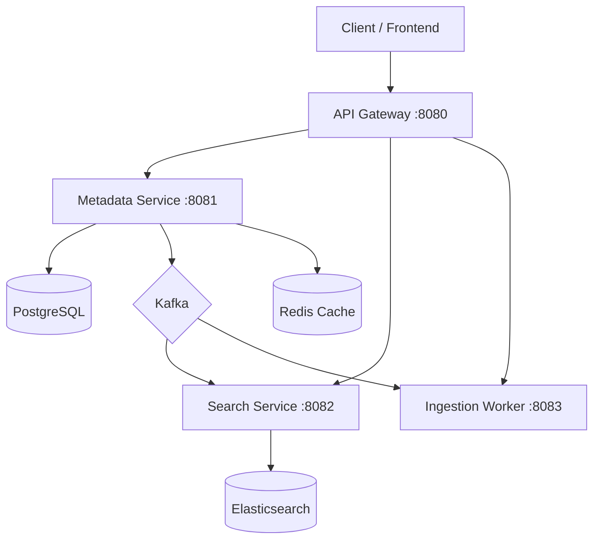

# 🎵 Sony Music Microservices Platform

Welcome to the **Sony Music Metadata Management** codebase. This is a reference implementation of an enterprise-grade microservices system.

## 🏗️ Architecture



## 🚀 Services Overview

| Service | Port | Description | Tech |
| :--- | :--- | :--- | :--- |
| **API Gateway** | `8080` | Entry point, routing, **Circuit Breaker** | Spring Cloud Gateway |
| **Metadata Service** | `8081` | CRUD, **Swagger UI**, **Redis Caching** | Spring Boot, JPA, Postgres |
| **Search Service** | `8082` | Full-text search | Spring Data Elasticsearch |
| **Ingestion Worker** | `8083` | Bulk XML/JSON parser | Spring Kafka Consumer |

## 🛠️ How to Run (Quickstart)

### Prerequisites
*   Docker & Docker Compose
*   Java 17
*   Maven

### 1. Build the Code
```bash
mvn clean package -DskipTests
```

### 2. Start the Stack
```bash
docker-compose up -d --build
```
*Wait about 2 minutes for Kafka and ElasticSearch to initialize.*

### 3. Verify
Check the status of containers:
```bash
docker-compose ps
```

---

## 🌟 Enterprise Features Implemented

### 1. 📜 API Documentation (Swagger/OpenAPI)
*   **Access**: [http://localhost:8081/swagger-ui.html](http://localhost:8081/swagger-ui.html)
*   **Use it for**: Visualizing and testing the Metadata APIs without Postman.

### 2. ⚡ Distributed Caching (Redis)
*   **Endpoint**: `GET /api/metadata/tracks/{isrc}`
*   **Behavior**: The first call hits PostgreSQL. Subsequent calls hit **Redis** (instant response).
*   **Verify**: Check Redis logs or monitor latency drop.

### 3. 🛡️ Circuit Breaker (Resilience4j)
*   **Behavior**: If `metadata-service` goes down, the API Gateway detects it.
*   **Fallback**: Instead of a 500 Internal Server Error, the Gateway reroutes to a "Fallback" controller returning a friendly JSON message.

---

## 🧪 Testing the APIs

**1. Create a Track (Core Flow)**
*   **POST** `http://localhost:8080/api/metadata/tracks`
*   Body:
    ```json
    {
      "title": "Anti-Hero",
      "isrc": "US-TSJ-22-00012",
      "durationSec": 190,
      "albumId": "3fa85f64-5717-4562-b3fc-2c963f66afa6"
    }
    ```
*   *Expected Result*: 201 Created. This wraps the call to `metadata-service`.

**2. Verify Event Propagation (Kafka -> Search)**
*   Wait 2 seconds.
*   **GET** `http://localhost:8080/api/search/tracks?query=Hero`
*   *Expected Result*: You should see the track "Anti-Hero" in the response, served from **Elasticsearch**.

**3. Bulk Ingestion (Simulated)**
*   *Producer*: Send a message to `metadata-upload` topic.
*   *Consumer*: Check logs of `ingestion-worker-service`.

---

## 📚 Technical "War Stories" (For Interviews)

1.  **Duplicate ISRCs**: "I implemented a check in `MetadataService` to prevent duplicate ISRC codes. If a duplicate comes in, we update the existing record instead of failing."
2.  **Eventual Consistency**: "When a track is created, it's not immediately searchable. We publish an event to Kafka, and the `SearchService` consumes it to update the Elasticsearch index."
3.  **Circuit Breaking**: (Simulate by stopping `metadata-service`) "The API Gateway isolates failures."
4.  **Cache Stampede**: "Implemented Redis caching for high-traffic metadata reads."

---

**Author**: Dnyanesh Patil
**License**: MIT
